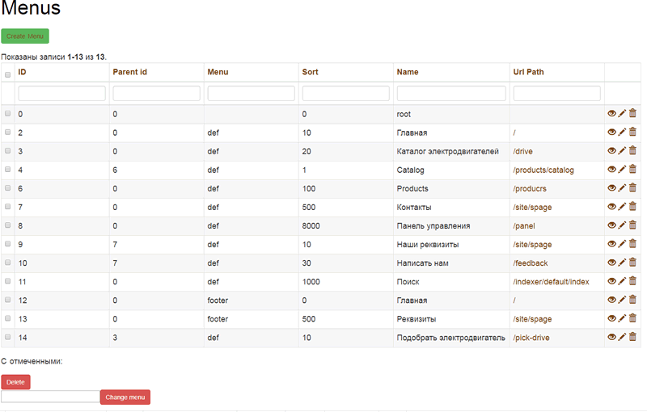
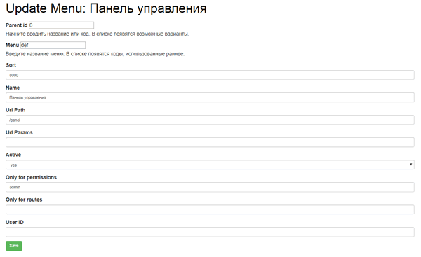

Menu - module for Yii2
======================

The module is designed to organize several menus on the site.

Supported restriction on the display of each menu item

-   by route

-   by access rights

You can show guests one thing and administrators another.

\-----------------------------------------

Модуль предназначен для организации нескольких меню на сайт.

Поддерживается ограничение на показ каждого пункта меню

-   по route

-   по правам доступа

Можно показать гостям одно, а администраторам другое.

\-----------------------------------------

Install
=======

Use composer

~~~~~~~~~~~~~~~~~~~~~~~~~~~~~~~~~~~~~~~~~~~~~~~~~~~~~~~~~~~~~~~~~~~~~~~~~~~~~~~~
composer require "quanzo/yii2-menu"
~~~~~~~~~~~~~~~~~~~~~~~~~~~~~~~~~~~~~~~~~~~~~~~~~~~~~~~~~~~~~~~~~~~~~~~~~~~~~~~~

or add in section *require* in *composer.json*

~~~~~~~~~~~~~~~~~~~~~~~~~~~~~~~~~~~~~~~~~~~~~~~~~~~~~~~~~~~~~~~~~~~~~~~~~~~~~~~~
"quanzo/yii2-menu": "*"
~~~~~~~~~~~~~~~~~~~~~~~~~~~~~~~~~~~~~~~~~~~~~~~~~~~~~~~~~~~~~~~~~~~~~~~~~~~~~~~~

Install db migration.

Configure
---------

~~~~~~~~~~~~~~~~~~~~~~~~~~~~~~~~~~~~~~~~~~~~~~~~~~~~~~~~~~~~~~~~~~~~~~~~~~~~~~~~
$config = [
    'modules' => [
        'menu' => [
            'class' => 'x51\yii2\modules\menu\Module',
            'as access' => [
                'class' => \yii\filters\AccessControl::className(),
                'rules' => [
                    [
                        'allow' => true,
                        'roles' => ['menu_manage'],
                     ],
                     [
                         'allow' => false,
                         'roles' => ['?'],
                     ],
                 ],
             ],
        ],
    ],
];
~~~~~~~~~~~~~~~~~~~~~~~~~~~~~~~~~~~~~~~~~~~~~~~~~~~~~~~~~~~~~~~~~~~~~~~~~~~~~~~~

 

How use
-------

~~~~~~~~~~~~~~~~~~~~~~~~~~~~~~~~~~~~~~~~~~~~~~~~~~~~~~~~~~~~~~~~~~~~~~~~~~~~~~~~

<?=Menu::widget([
    'items' => \x51\yii2\modules\menu\helpers\MenuHelper::getMenu('menu-name'),
    'options' => [],
    'activeCssClass' => 'current',
]);?>

~~~~~~~~~~~~~~~~~~~~~~~~~~~~~~~~~~~~~~~~~~~~~~~~~~~~~~~~~~~~~~~~~~~~~~~~~~~~~~~~

Picture
-------

